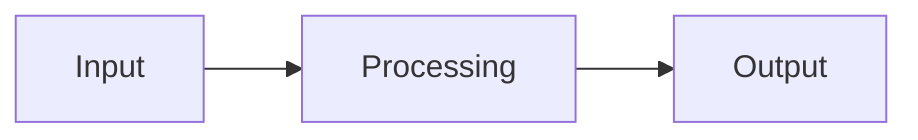
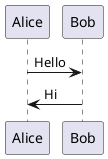

# 🔧 Installation Guide for Hmmmmnm Diagram Encoder Extension

The **Hmmmmnm Diagram Encoder** is a Chrome Extension that helps you easily create and encode Mermaid and PlantUML diagrams. The extension can work in two modes:

* **Option A**: Use with Docker Kroki (faster rendering, higher quality)
* **Option B**: Use directly with the public Kroki server without running Docker (simpler for beginners)

---

## 📋 System Requirements

* **Browser**: Google Chrome, Microsoft Edge, or any Chromium-based browser
* **Internet connection**: Required for AI features (Gemini) – under development

---

## 🚀 Option A: Setup with Docker Kroki (Recommended)

### Step 1: Install Docker

#### On Windows:

1. Download Docker Desktop from [https://www.docker.com/products/docker-desktop](https://www.docker.com/products/docker-desktop)
2. Run the installer and follow the instructions
3. Restart your computer if prompted
4. Open Docker Desktop and log in (or create a free account)

#### On macOS:

1. Download Docker Desktop for Mac from [https://www.docker.com/products/docker-desktop](https://www.docker.com/products/docker-desktop)
2. Drag `Docker.app` into the Applications folder
3. Open Docker from Applications and follow the setup instructions

#### On Linux (Ubuntu/Debian):

```bash
# Update packages
sudo apt update

# Install Docker
sudo apt install docker.io docker-compose

# Add your user to the docker group
sudo usermod -aG docker $USER

# Restart to apply changes
sudo systemctl enable docker
sudo systemctl start docker
```

### Step 2: Setup Kroki Server

1. **Create project folder:**

   ```bash
   mkdir hmmmmnm-kroki
   cd hmmmmnm-kroki
   ```

2. **Create a `docker-compose.yml` file**

3. **Start services:**

   ```bash
   docker-compose up -d
   ```

4. **Verify:**

   * Open [http://localhost:8000](http://localhost:8000) in your browser
   * You should see the Kroki API interface

### Step 3: Install the Extension

1. **Download source code:**

   * Download and extract the extension source code
   * Or clone it from the repository (if available)

2. **Install extension:**

   * Open Chrome and go to `chrome://extensions/`
   * Enable "Developer mode" in the top right corner
   * Click "Load unpacked" and select the folder containing the extension source code
   * The extension will appear in the list

3. **Verify installation:**

   * Click the extension icon on the toolbar
   * Enter Mermaid or PlantUML code
   * Click "🚀 Encode" to test

---

## 🌟 Option B: Setup Without Docker (Beginner Friendly)

### Step 1: Download and Prepare Extension

1. **Download source code:**

   * Download the ZIP file containing the extension source code
   * Extract it to an easy-to-find folder (e.g., `Desktop/hmmmmnm-extension`)

2. **Check required files:**
   Ensure the folder contains:

   * `manifest.json`
   * `popup.html`
   * `popup.css`
   * `popup.js`
   * `pako.min.js`

### Step 2: Install Extension

1. **Open Chrome Extensions:**

   * Open Chrome
   * Go to `chrome://extensions/`
   * Press Enter

2. **Enable Developer Mode:**

   * Toggle "Developer mode" on (top-right corner)

3. **Load Extension:**

   * Click "Load unpacked"
   * Select the folder containing the extension source code
   * Click "Select Folder"

4. **Confirm installation:**

   * The extension will appear in the list
   * The icon will appear on Chrome’s toolbar

### Step 3: Use the Extension

1. **Open extension:**

   * Click the extension icon on the toolbar
   * The popup interface will appear

2. **Create a diagram:**

   * Choose diagram type (Mermaid or PlantUML)
   * Enter your diagram code in the text box
   * Click "🚀 Encode" to generate a link

3. **Use AI (optional):**

   * Click "❓ Ask LLM"
   * Enter a request in natural language (e.g., in Vietnamese or English)
   * The AI will generate the diagram code automatically

---

## 🔧 Usage Guide

### Create a Diagram Manually

1. **Select diagram type:**

   * Use the "📊 Language" dropdown
   * Choose "Mermaid" or "PlantUML"

2. **Enter code:**

   ```mermaid
   graph TD
       A[Start] --> B{Check}
       B -->|Yes| C[Process]
       B -->|No| D[Error]
       C --> E[End]
       D --> E
   ```

3. **Encode and use:**

   * Click "🚀 Encode"
   * Click "↗️ Open Link" to view the diagram
   * Click "📥 Download SVG" to save the image

### Use the AI Assistant

1. **Open AI modal:**

   * Click the "❓ Ask LLM" button

2. **Enter request:**

   ```
   Create a Mermaid diagram of a user registration process
   ```

3. **Receive results:**

   * The AI will auto-generate the code
   * The code will be inserted into the input box
   * You can edit it before encoding

---

## 🛠️ Troubleshooting

### Extension not showing up

* **Cause**: Developer mode not enabled
* **Solution**: Go to `chrome://extensions/` and enable Developer mode

### Encoding doesn’t work

* **Cause**: Syntax error in diagram code
* **Solution**: Double-check syntax and refer to official documentation

### Docker won’t start (Option A)

* **Cause**: Port 8000 already in use
* **Solution**:

  ```bash
  docker-compose down
  docker-compose up -d
  ```

### AI not working

* **Cause**: No internet connection or expired API key
* **Solution**: Check your internet connection

---

## 🎯 Tips & Tricks

### Performance Optimization

* With Option A (Docker): Faster rendering and higher quality
* With Option B: Simpler, better for learning and testing

### Useful Code Samples

**Mermaid Flowchart:**



**PlantUML Sequence:**



---

## 📞 Support

If you encounter issues during installation or usage, you can:

* Review the steps in this guide
* Restart your browser after installing the extension
* Ensure you have a stable internet connection

**Enjoy using the extension! 🎉**

---
