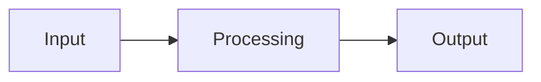
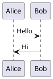

# 🔧 Installation Guide for Hmmmmnm Diagram Generator Extension

Hmmmmnm Diagram Generator is a Chrome Extension that enables you to create, encode, and render Mermaid and PlantUML diagrams with AI assistance. The extension supports two modes:

  * **Option A:** Use with Docker Kroki (faster rendering, higher quality)
  * **Option B:** Use directly with the public Kroki server without running Docker (simpler for beginners)

-----

## 📋 System Requirements

  * **Browser:** Google Chrome, Microsoft Edge, or any Chromium-based browser.
  * **Internet Connection:** Required for AI features (Gemini or Open AI).
  * **Docker (for Option A):** Docker Desktop (Windows/macOS) or Docker (Linux).

-----

## 🚀 Option A: Setup with Docker Kroki (Recommended)

### Step 1: Install Docker

**On Windows:**

1.  Download Docker Desktop from [https://www.docker.com/products/docker-desktop](https://www.docker.com/products/docker-desktop).
2.  Run the installer and follow the instructions.
3.  Restart your computer if prompted.
4.  Open Docker Desktop and log in (or create a free account).

**On macOS:**

1.  Download Docker Desktop for Mac from [https://www.docker.com/products/docker-desktop](https://www.docker.com/products/docker-desktop).
2.  Drag `Docker.app` into the **Applications** folder.
3.  Open Docker from **Applications** and follow the setup instructions.

**On Linux (Ubuntu/Debian):**

```bash
# Update packages
sudo apt update

# Install Docker
sudo apt install docker.io docker-compose

# Add your user to the docker group
sudo usermod -aG docker $USER

# Restart to apply changes
sudo systemctl enable docker
sudo systemctl start docker
```

### Step 2: Setup Kroki Server

1.  **Create project folder:**

    ```bash
    mkdir hmmmmnm-kroki
    cd hmmmmnm-kroki
    ```

2.  **Create a `docker-compose.yml` file:**

    ```yaml
    version: '3'
    services:
      kroki:
        image: yuzutech/kroki
        ports:
          - "8000:8000"
    ```

3.  **Start services:**

    ```bash
    docker-compose up -d
    ```

4.  **Verify:**

      * Open `http://localhost:8000` in your browser.
      * You should see the Kroki API interface.

### Step 3: Install the Extension

1.  **Download source code:**

      * Download and extract the extension source code to `/Users/macbook/Documents/diagram-generator`.
      * Or clone it from the repository (if available).

2.  **Install extension:**

      * Open Chrome and go to `chrome://extensions/`.
      * Enable **"Developer mode"** in the top right corner.
      * Click **"Load unpacked"** and select the `/Users/macbook/Documents/diagram-generator/dist` folder.
      * The extension will appear in the list.

3.  **Configure Settings:**

      * Click the extension icon to open the popup.
      * Click the **"⚙️ Settings"** button.
      * Set:
          * **Image Width (px):** e.g., `1000`
          * **Image Height (px):** e.g., `800`
          * **API Key:** Obtain from [Google AI Studio](https://aistudio.google.com/app/apikey) for Gemini or [OpenAI Platform](https://platform.openai.com/api-keys) for Open AI.
          * **Server URL:** Set to `http://localhost:8000` for Docker Kroki.
          * **API Provider:** Choose **Gemini** or **Open AI**.
          * **Model:** Select a model (e.g., `gemini-1.5-flash-latest` for Gemini, `gpt-4o` for Open AI).
      * Click **"Save"** to save settings.

4.  **Verify installation:**

      * Click the extension icon.
      * Enter Mermaid or PlantUML code (e.g., `graph TD; A[Start] --> B[Process]; B --> C[End];`).
      * Click **"↗️ Open Link"** to test rendering with the configured server.

-----

## 🌟 Option B: Setup Without Docker (Beginner Friendly)

### Step 1: Download and Prepare Extension

1.  **Download source code:**

      * Download the ZIP file containing the extension source code.
      * Extract it to `/Users/macbook/Documents/diagram-generator`.

2.  **Check required files:**

      * Ensure the folder contains:
          * `manifest.json`
          * `index.html`
          * `assets/` (JS and CSS files)
          * `llm-config.js`
          * `pako.min.js`

### Step 2: Install Extension

1.  **Open Chrome Extensions:**

      * Open Chrome.
      * Go to `chrome://extensions/` and press **Enter**.

2.  **Enable Developer Mode:**

      * Toggle **"Developer mode"** on (top-right corner).

3.  **Load Extension:**

      * Click **"Load unpacked"**.
      * Select the `/Users/macbook/Documents/diagram-generator/dist` folder.
      * Click **"Select Folder"**.

4.  **Configure Settings:**

      * Click the extension icon to open the popup.
      * Click the **"⚙️ Settings"** button.
      * Set:
          * **Image Width (px):** e.g., `1000`
          * **Image Height (px):** e.g., `800`
          * **API Key:** Obtain from [Google AI Studio](https://aistudio.google.com/app/apikey) for Gemini or [OpenAI Platform](https://platform.openai.com/api-keys) for Open AI.
          * **Server URL:** Keep default `https://kroki.io` or set a custom server.
          * **API Provider:** Choose **Gemini** or **Open AI**.
          * **Model:** Select a model (e.g., `gemini-1.5-flash-latest` for Gemini, `gpt-4o` for Open AI).
      * Click **"Save"** to save settings.

5.  **Confirm installation:**

      * The extension will appear in the list.
      * The icon will appear on Chrome’s toolbar.

### Step 3: Use the Extension

1.  **Open extension:**

      * Click the extension icon on the toolbar.
      * The popup interface (580x400px) will appear.

2.  **Create a diagram:**

      * Choose diagram type (Mermaid or PlantUML) from the dropdown.
      * Enter your diagram code in the text box.
      * Click **"↗️ Open Link"** to view the diagram or **"📥 Download SVG"** to download it.

3.  **Use AI Assistant:**

      * Click **"❓ Ask LLM"**.
      * Enter a natural language request (e.g., "Create a flowchart diagram for a user registration process").
      * Select the desired API provider and model in **Settings** if not already set.
      * The AI will generate diagram code and insert it into the text box.

-----

## 🔧 Usage Guide

### Configure Settings

1.  **Open Settings:**

      * Click the **"⚙️ Settings"** button in the popup.
      * The Settings modal will appear within the popup interface.

2.  **Set preferences:**

      * **Image Width/Height:** Adjust the output SVG size (100–2000px).
      * **API Key:** Enter a valid key for Gemini or Open AI.
      * **Server URL:** Use `https://kroki.io` (default) or a custom server (e.g., `http://localhost:8000` for Docker Kroki).
      * **API Provider:** Select **Gemini** or **Open AI**.
      * **Model:** Choose a model based on the provider (e.g., `gemini-1.5-pro-latest` or `gpt-4o`).
      * Click **"Save"** to save to local storage.

### Create a Diagram Manually

1.  **Select diagram type:**

      * Use the **"📊 Language"** dropdown.
      * Choose **"Mermaid"** or **"PlantUML"**.

2.  **Enter code:**

    ```mermaid
    graph TD
        A[Start] --> B{Check}
        B -->|Yes| C[Process]
        B -->|No| D[Error]
        C --> E[End]
        D --> E
    ```

3.  **Encode and use:**

      * Click **"↗️ Open Link"** to view the diagram in a new tab.
      * Click **"📥 Download SVG"** to download the diagram as an SVG file.
      * Press **Ctrl+Enter** to quickly trigger encoding.

### Use the AI Assistant

1.  **Open AI modal:**

      * Click the **"❓ Ask LLM"** button.

2.  **Enter request:**

      * `Create a Mermaid diagram for a user registration process`

3.  **Receive results:**

      * The AI (Gemini or Open AI, based on Settings) will generate diagram code.
      * The code will be inserted into the input box.
      * Edit the code if needed, then click **"↗️ Open Link"** or **"📥 Download SVG"**.

-----

## 🛠️ Troubleshooting

### Extension Not Showing Up

  * **Cause:** Developer mode not enabled.
  * **Solution:** Go to `chrome://extensions/` and enable **Developer mode**.

### Encoding Doesn’t Work

  * **Cause:** Syntax error in diagram code or invalid Server URL.
  * **Solution:**
      * Double-check syntax against Mermaid or PlantUML documentation.
      * Ensure Server URL is valid (e.g., `https://kroki.io` or `http://localhost:8000`).

### Docker Won’t Start (Option A)

  * **Cause:** Port `8000` already in use.
  * **Solution:**
    ```bash
    # Stop current containers
    docker-compose down
    # Restart
    docker-compose up -d
    ```
      * Check port:
    <!-- end list -->
    ```bash
    sudo netstat -tuln | grep 8000
    ```

### AI Not Working

  * **Cause:** Invalid API key, no internet, or incorrect provider/model.
  * **Solution:**
      * Verify API key:
          * **Gemini:** [https://aistudio.google.com/app/apikey](https://aistudio.google.com/app/apikey)
          * **Open AI:** [https://platform.openai.com/api-keys](https://platform.openai.com/api-keys)
      * Check internet connection.
      * Open DevTools (**F12**) and inspect the console for API errors.
      * Ensure the correct provider and model are selected in Settings.

### Modal Not Displaying Correctly

  * **Cause:** CSS positioning issue.
  * **Solution:**
      * Open DevTools (**F12**), check the **SettingsModal** `div` to ensure `position: absolute`.
      * Ensure the parent container has `position: relative`.
      * Increase the `z-index` in `SettingsModal.jsx` if needed (e.g., `z-100`).

-----

## 🎯 Tips & Tricks

### Performance Optimization

  * **Option A (Docker):** Faster rendering, higher quality, ideal for frequent use.
  * **Option B:** Simpler setup, better for beginners or testing.

### Useful Code Samples

**Mermaid Flowchart:**



**PlantUML Sequence:**



### Custom Server

  * Use a local Kroki server (`http://localhost:8000`) for offline work or custom configurations.
  * Update the **Server URL** in Settings to switch servers dynamically.

-----

## 📞 Support

If you encounter issues during installation or usage:

  * Review the steps in this guide.
  * Restart your browser after installing the extension.
  * Check `localStorage` in DevTools (**Application** \> **Local Storage**) for saved settings.
  * Open DevTools (**F12**) to inspect console logs for API or rendering errors.
  * Ensure a stable internet connection for AI features.

Enjoy creating diagrams with the Hmmmmnm Diagram Generator\! 🎉